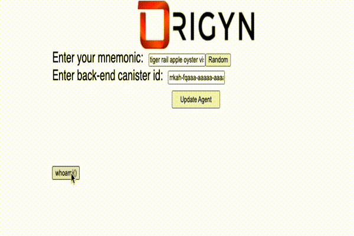

## whoami mnemonic

Sample canister with front-end using DFINITY > v7.0.0

Show an example on how to use a 24-words Bip39 mnemonic seed phrase as an identity (it instantiates a new `Agent`)

Example is within the `whoami` directory.

You can run `sh bootstrap.sh` from `whoami` directory.

